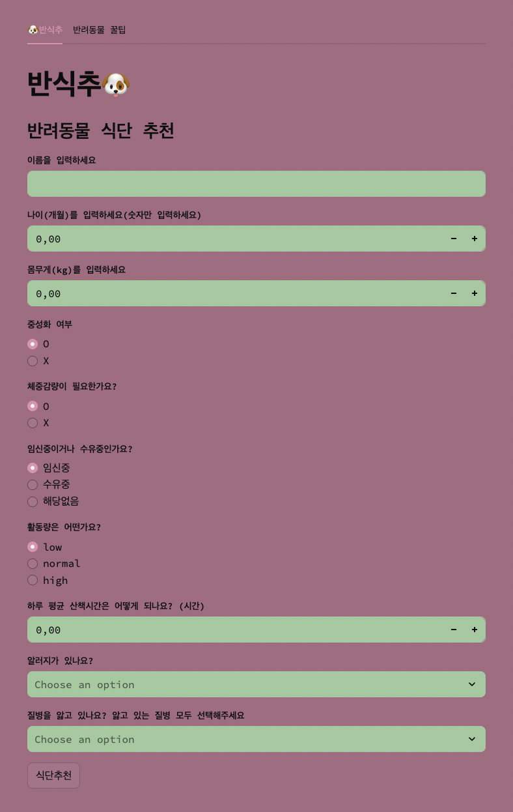
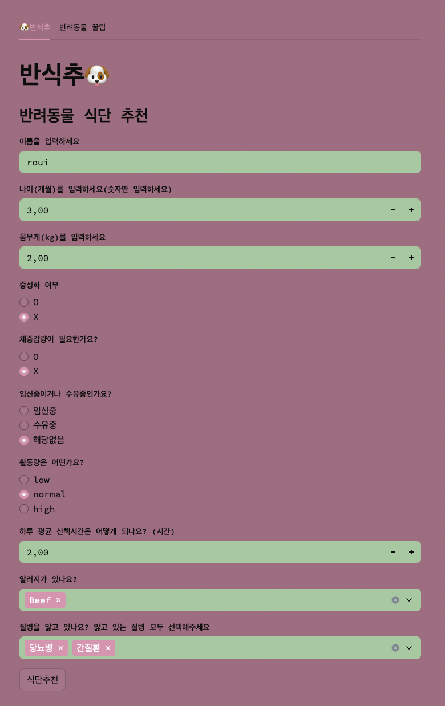
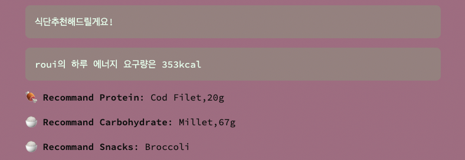

# 🐶 Project Title: Pet-diet-plan

## 🧠 Why I Built This
- ✅ I feel bad for my dog because he only eats dry feed.
- ✅ Because the feed contains unclear ingridients and I want to take care of their disease together
- ✅ I want to make a perfect meal plan that it doesn't contain any food that dog has allergies

## 🎯 Goal 
Create an interactive web application that: 
- Calorie counting
- Based on Calorie, a meal plan for a dog
- Excluding allergenic foods and ingridients that are harmful to the body
- Dog raising tips

## 🔍 Key Features

- 📝 Input: name, age, weight, activity level, allergies, diseases
- 🔢 Automatic calculation of:
  - RER (Resting Energy Requirement)
  - MER (Maintenance Energy Requirement)
  - Macronutrient grams (protein, carbs)
- ❌ Allergy filter for safe protein options
- 🍽 Meal recommendation with portion sizes
- 💡 Bonus tab: pet wellness tips (vaccination, omega-3, Heimlich, etc.)

## 🧩 Design Overview






### 🧑‍💻 User Flow

1. Input pet details: name, age, weight, neutering status, pregnancy, activity level
2. Select known allergies
3. Select existing health conditions (e.g., arthritis, diabetes, kidney disease)
4. Click “Recommend Diet”
5. View:
   - Daily calorie needs (MER)
   - Macronutrient breakdown (g of protein and carbs)
   - Randomized food recommendation (filtered by allergy)
   - Pet care tips (in separate tab)

### ⚙️ Logic

- **MER (Maintenance Energy Requirement)** is calculated using standard veterinary BMR formula and activity factor (AF)
- **Macronutrient ratio** varies depending on selected diseases (see: `disease_diet_profiles`)
- **Random ingredient selector** excludes allergenic proteins
- **Snacks** are randomly selected from veggie or fruit snacks
- Separate tab provides helpful pet care advice


## ⚙️ Tech Stack
| Technology | Purpose                             |
|------------|-------------------------------------|
| Python     | Core logic and calculations         |
| Streamlit  | UI & interaction framework          |


## 🧪 Sample Input & Output

**Sample Input:**
- Name: Louie
- Age: 3 years (36 months)
- Weight: 6.5 kg
- Neutered: Yes
- Activity: Medium (1–2 hours walking)
- Allergies: Chicken
- Diseases: Arthritis

**Output:**
- Caloric Needs (MER): 480 kcal
- Recommended Protein: Salmon, 30g
- Recommended Carbs: Brown Rice, 40g
- Recommended Snack: Green Beans
---
## 🚀 How to Run

```bash
# 1. Install dependencies
pip install streamlit

# 2. Run the app
streamlit run pet_diet_main.py
```

## 📈 Future Improvements

- 🐱 Add support for cats
- 🛒 Show ingredient prices from online stores via API
- 🖨 Add PDF meal plan export
- 📊 Visualize macro breakdown with pie charts


## 📚 What I Learned

- Built a fully functional interactive app using Streamlit
- Applied real-world veterinary nutrition logic in code
- Handled multi-input conditions and real-time feedback
- Designed a simple yet user-friendly experience for pet owners


## 🌱 One-Line Summary

**An interactive tool to make your dog’s meals healthier, safer, and more personalized – built with code and care.**


## 🙋 About the Developer

I'm a student at an ABCIS who loves animals and solving problems with code.

This project reflects both my creativity and desire to apply what I’ve learned to improve everyday life—for both humans and pets 🐶.